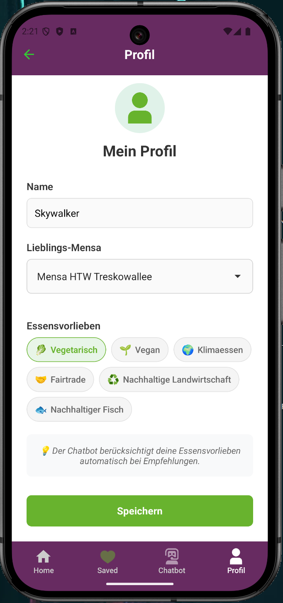

# Kantino - Mensa App Berlin

Eine React Native App für Berliner Mensen und Cafeterias.

## Autoren
Béla von Wangenheim  
Nouran Alhabash  
Marlies Sami Alexandra Nelle  
Mirav Ahmad  

## Features

* Übersicht aller Berliner Mensen und Cafeterias
* Aktuelle Speisepläne anzeigen
* Lieblings-Mensen und -Gerichte speichern
* Navigation zu Mensen via Google Maps
* AI-Chatbot für Fragen rund um Mensen und Speisen (in Entwicklung)
* Offline-Funktionalität mit automatischem Caching
* Erweiterte Suchfunktion

## Tech Stack

* React Native 0.79.3
* Expo SDK 53
* TypeScript
* AsyncStorage für lokale Datenspeicherung
* NetInfo für Offline-Support

## Installation

1. **Dependencies installieren**
   ```bash
   npm install
   ```

2. **App starten**
   ```bash
   npx expo start --clear
   ```

3. **App öffnen**
   - Expo Go App (QR-Code scannen)
   - Android Emulator
   - iOS Simulator

## Screenshots
### Startseite


### Mensenübersicht


### Mensenübersicht - Details


### Speiseplan


### Saved - Mensen


### Saved - Gerichte


### AI-Chatbot


### Profil


---

*Entwickelt mit Expo und React Native*